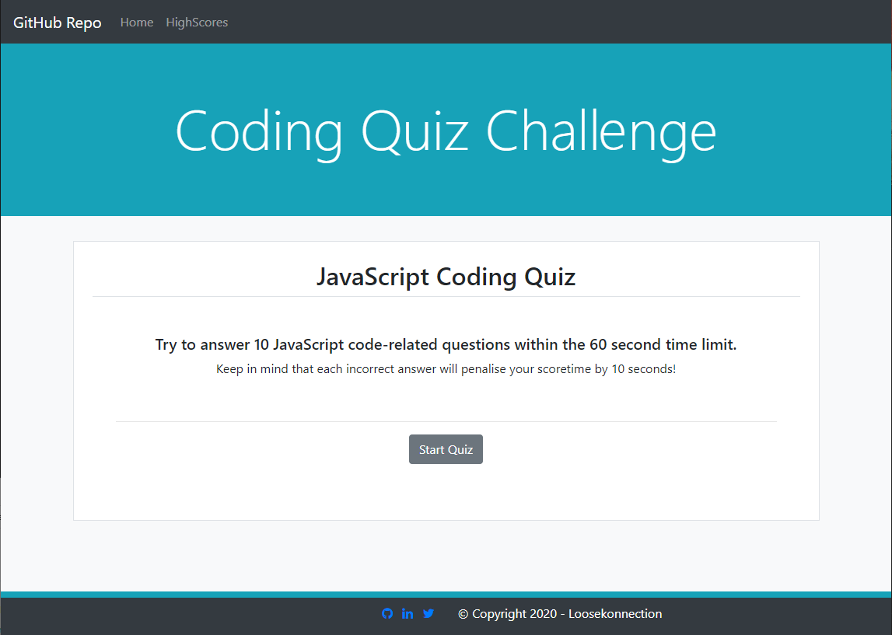
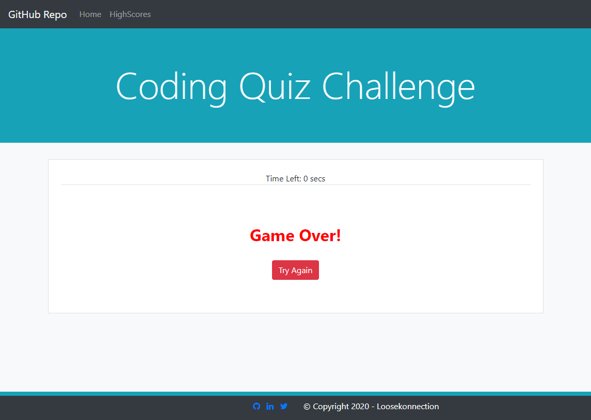

# JSCodeQuiz
Quiz about JavaScript coding

*   GitHub Repository [JavaScript Coding Quiz](https://github.com/Loosekonnection/JSCodeQuiz)
*   GitHub Pages URL [Coding Quiz Webpage](https://loosekonnection.github.io/JSCodeQuiz/)
---

<br>

## Pseudo Code

*   An HTML page needs creating with respective id's to hold the quiz and the dynamically created questions.
*   HTML Page Elements required would be:

    *   Navigation Section
    *   Banner Section
    *   Quiz Section
    *   Footer Section

*   The home page will need an brief explanation of the quiz.
*   There will need to be a Start Quiz button on the home page that dynamically via JS displays a series of questions with there respective answers.
*   Upon the selection of an answer the next question should be then displayed dynamically via JS.
*   If the question is correct then the player should be notified via a ```Correct!``` message.
*   If the question is incorrect the player should be notified via a ```Wrong!``` message.
*   Upon starting the quiz there will need to be a dynamically JS displayed countdown timer.
*   If all questions are not answered within the time frame, a game over message with the ability to retry will need to be displayed.
*   If all of the questions are answered within the time frame, the time left on the timer should be displayed as the players score.
*   The displayed score should be presented with an input field for the player to submit and record their initials or name along with the score.
*   The players initials/name and score will need to be stored in the local storage (as we are not using a database for this).
*   The site will need a High Scores page to display recorded high scores.
*   The High Scores page will need HTML page elements and id's for both static and dynamic content:

    *   Navigation Section
    *   Banner Section
    *   High Scores Section
    *   Footer Section

*   The High Scores page will also have two buttons:

    *   Go Back - to return the user to the home page. (although the NAV will contain a link to the homepage)
    *   Clear High Scores - Clear the local storage which will clear the High Scores table/page.


---

<br>


##  Using the Quiz

*   The JavaScript Coding Quiz home page has a breif description and start quiz button.
*   The links in the NAV can be used as follows:

    *   GitHub Repo - redirect to the GitHub Repository.
    *   Home - Homepage which is the main landing page.
    *   HighScores - Redirects to the High Scores page and table.   



*   Upon clicking the 'Start Quiz' button the quiz randomly picks 10 questions to answer from a pool of questions.
*   You will need to choose/select an answer to progress to the next question.
*   There is a timer of 60 seconds that starts immediately upon starting the quiz.


*   You will be advised if your answer selection was Correct! or Wrong!


*   For every incorrect answer 10 seconds is taken from the countdown timer.
*   If the timer ends before the player can complete all questions, a Game Over! message is displayed and a retry button is displayed.



*   If a player succesfully completes all 10 questions within the 60 seconds, The players score is the remaining time left over after completing all 10 questions.
*   The player is then prompted to input their initials/name.


*   The player's initials and score are then added to the Highscore table.


---

<br>

## Credits

*   University of Birmingham [Coding Boot Camp](https://bootcamp.birmingham.ac.uk/coding/)
*   The Document Object Model [The Net Ninja](https://www.youtube.com/watch?v=wKBu_dEaF9E&list=PL4cUxeGkcC9haFPT7J25Q9GRB_ZkFrQAc&index=6)
*   DOM crash course with Brad Traversy [Traversy Media](https://www.youtube.com/watch?v=0ik6X4DJKCc&list=PLillGF-RfqbbnEGy3ROiLWk7JMCuSyQtX&index=2)
*   Most of the answers to my research on this project have come from [Stack Overflow](https://stackoverflow.com/).
*   For syntax help when finding a solution elsewhere [w3schools.com](https://www.w3schools.com/jsref/default.asp) is and has been a fantastic reference guide to use along with Stack Overflow.

---
<br>


<br>

---
© 2020 Loosekonnection, Working towards being a Full Stack Dev.
